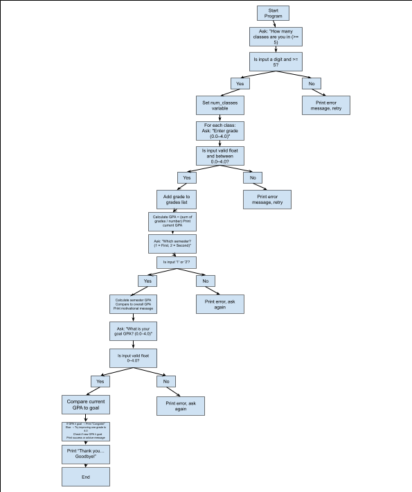

# The Overly Verbose GPA Calculator

## Overview
Welcome to the Overly Verbose GPA Calculator. This is a Python program. This program is excited to help you calculate your GPA. This program walks you through entering your grades, checking your semester averages, setting a GPA goal, and even gives you advice on how to reach that goal. 

## Features
- Prompts users to enter grades for 5 or more classes  
- Calculates:
  - Overall GPA  
  - First or second semester GPA  
- Offers personalized feedback on academic progress  
- Lets you set a goal GPA and shows if you can reach it by improving a single class  
- Includes clear input validation and helpful messages for incorrect entries  

## How It Works
1. The program starts by asking how many classes you’re in (minimum of 5).  
2. You’ll enter each class grade on a 4.0 scale.  
3. It then calculates your current overall GPA.  
4. You can view your semester GPA (first or second half of your classes).  
5. Set your goal GPA, and the program will:  
   - Check if you already meet it  
   - Suggest possible single-grade improvements to help reach it  

## Requirements
- Python 3

## How to Run
1. Download or clone this repository.  
2. Open a terminal or command prompt in the project directory.  
3. Run the program with:  python overly_verbose_gpa_calculator.py

## Notes
- All GPA values must be between 0.0 and 4.0.  
- The calculator assumes there is a equal credit weight for all classes.  
- This program provides detailed feedback and guidance.

## How It Runs

 